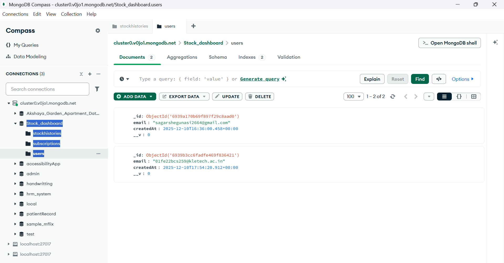
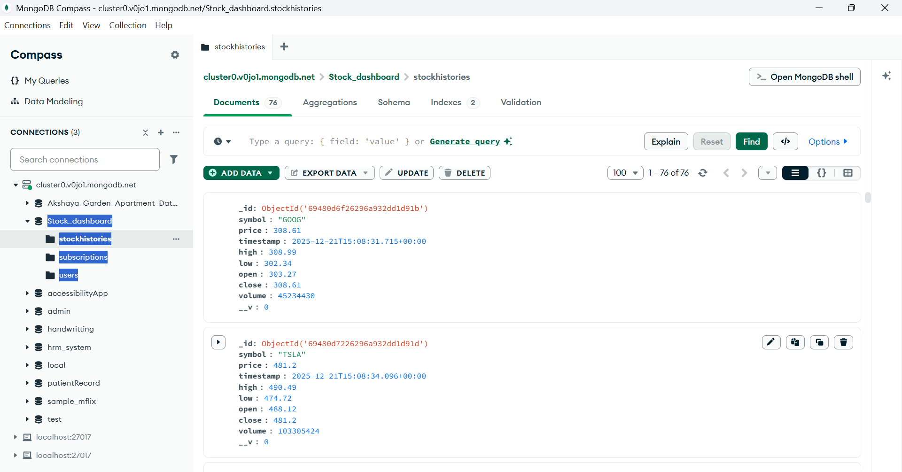
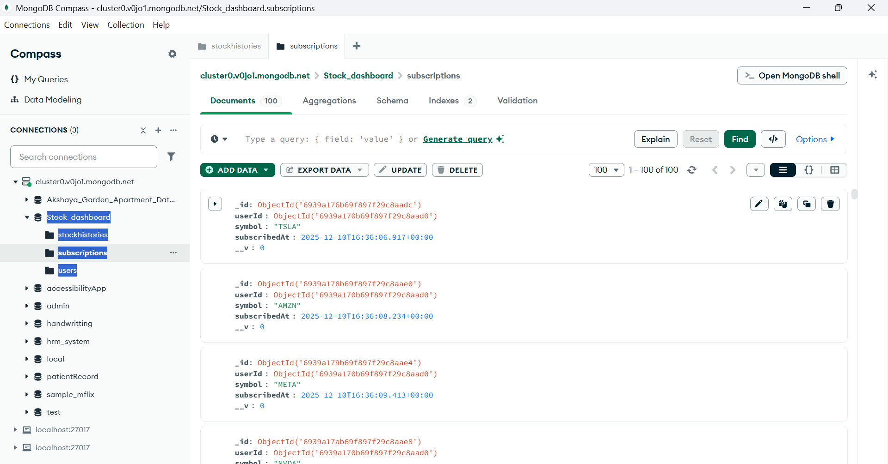
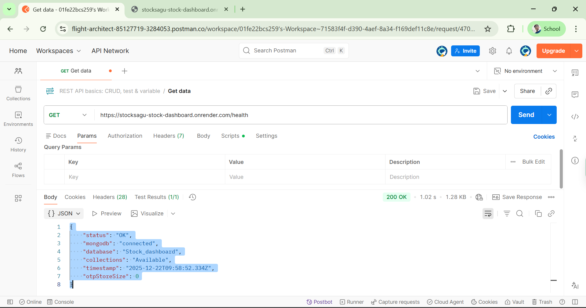
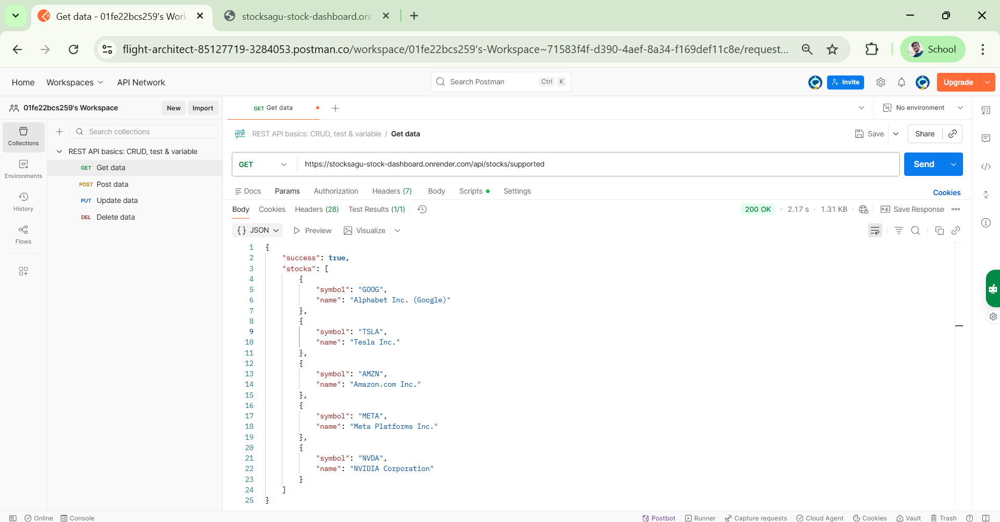

# 📈 StockSagu – Real-Time Stock Dashboard

StockSagu is a **real-time stock monitoring web application** that allows users to securely log in using email OTP, subscribe to selected stocks, and view **live price updates**.  
The system is designed with a **clean architecture**, real-time data flow, and scalable backend services.

---

## 🌟 Live Demo

- **Frontend:** https://stocksagu-stock-dashboard-1.onrender.com  
- **Backend API:** https://stocksagu-stock-dashboard.onrender.com  

---

## 🔐 Authentication & Security

- Email-based **OTP authentication**
- OTP delivery via **Brevo (Sendinblue) Email Service**
- OTP expires in **10 minutes**
- Token-based session management
- Simple and secure login flow (no passwords stored)

---

## 📈 Real-Time Stock Features

- Fetches **real stock prices** from **Alpha Vantage API**
- Supported stocks:
  - `GOOG`
  - `TSLA`
  - `AMZN`
  - `META`
  - `NVDA`
- Automatic price refresh every **15 seconds**
- Stores **last 24 hours** of historical price data
- WebSocket-based live updates (no page refresh)

---

## 💼 Portfolio & Subscriptions

- Subscribe to favorite stocks
- Personalized watchlist per user
- Real-time updates only for subscribed stocks
- Clean and minimal portfolio view

---

## 🖥️ User Interface

- Modern **dark theme**
- Clean layout with smooth interactions
- Optimized for performance and readability

---

## 🧱 System Architecture Overview

- **Frontend:** React.js  
- **Backend:** Node.js + Express.js  
- **Database:** MongoDB  
- **Real-Time:** WebSockets  
- **External APIs:** Alpha Vantage, Brevo  

The system follows a **modular architecture**, separating authentication, subscriptions, stock data handling, and real-time services.

---
## 🔄 UML Sequence Diagram

The following UML Sequence Diagram represents the **complete runtime flow** of the StockSagu system, covering:

- Email-based OTP authentication using Brevo
- OTP verification and token generation
- Periodic stock price fetching from Alpha Vantage
- Storage of historical stock data in MongoDB
- WebSocket-based real-time stock price broadcasting
- Live dashboard updates for subscribed users without page refresh


---


## 🗂️ Entity Relationship (ER) Diagram


### 📌 ER Diagram Explanation

The database is designed using a **normalized and scalable schema** with three main entities:

#### 1. **Users**
- Stores registered user information
- Each user is uniquely identified by `id`
- A user can subscribe to **multiple stocks**

**Key Attributes:**
- `id` (Primary Key)
- `email`
- `createdAt`

---

#### 2. **Subscriptions**
- Acts as a **bridge** between Users and Stocks
- Represents which stock symbols a user is subscribed to
- Enables a **One-to-Many** relationship from Users to Subscriptions

**Key Attributes:**
- `id` (Primary Key)
- `userId` (Foreign Key → Users.id)
- `symbol`
- `subscribedAt`

---

#### 3. **StockHistories**
- Stores real-time and historical stock price data
- Maintains **time-series data** for each stock symbol
- Used for charts, indicators, and historical analysis

**Key Attributes:**
- `id` (Primary Key)
- `symbol`
- `timestamp`
- `price`
- `open`
- `close`
- `high`
- `low`
- `volume`
- `priceChange` (derived)

---

### 🔗 Relationships Summary

- **User → Subscriptions:** One-to-Many  
- **Subscription → StockHistories:** One-to-Many  
- Stock symbol is treated as an **attribute**, not a separate entity (intentional design choice)

---
## 🗄️ MongoDB Collections Overview

The application stores data across three MongoDB collections:

### 📊 Database Snapshots

<div align="center">





</div>

---

# 🧱 Complete Project Structure

```
backend/
├── .env
├── package.json
├── server.js
├── config/
│   └── database.js
├── models/
│   ├── User.js
│   ├── Subscription.js
│   └── StockHistory.js
├── controllers/
│   ├── authController.js
│   ├── stockController.js
│   └── subscriptionController.js
├── routes/
│   ├── authRoutes.js
│   ├── stockRoutes.js
│   └── subscriptionRoutes.js
├── services/
│   ├── stockService.js
│   └── socketService.js
├── utils/
│   ├── constants.js
│   └── helpers.js
└── middleware/
    └── auth.js


frontend/
├── package.json
├── public/
│   └── index.html
├── src/
│   ├── index.js
│   ├── App.js
│   ├── App.css
│   ├── index.css
│   ├── api/
│   │   └── api.js
│   ├── components/
│   │   ├── Login.js
│   │   ├── Dashboard.js
│   │   ├── StockList.js
│   │   ├── StockCard.js
│   │   └── SubscriptionManager.js
│   ├── context/
│   │   └── AuthContext.js
│   ├── hooks/
│   │   └── useWebSocket.js
│   └── utils/
│       └── constants.js
```

---

## 🚀 Setup

### Backend
```
cd backend
npm install
npm run dev
```

### Frontend
```
cd frontend
npm install
npm start
```

---

## 🔌 API (Short)
- `POST /api/auth/send-otp`
- `POST /api/auth/verify-otp`
- `GET /api/stocks/prices`
- `POST /api/subscriptions/subscribe`
- `GET /health`

---

## 🧪 API Testing (Postman)

The backend APIs were tested using **Postman** to ensure correctness, availability, and data consistency.

### ✅ GET Requests Tested

<div align="center">




</div>

---

---
## 🔗 External Services
- **Alpha Vantage API (Stock Prices):**  
  https://www.alphavantage.co/support/#api-key  

- **Brevo (Sendinblue) Email Service (OTP):**  
  https://www.brevo.com  

---

## 🙏 Support
Email: **sagarshegunasi2664@gmail.com**

Made with ❤️ by Sagar  

Last Updated: December 2024
